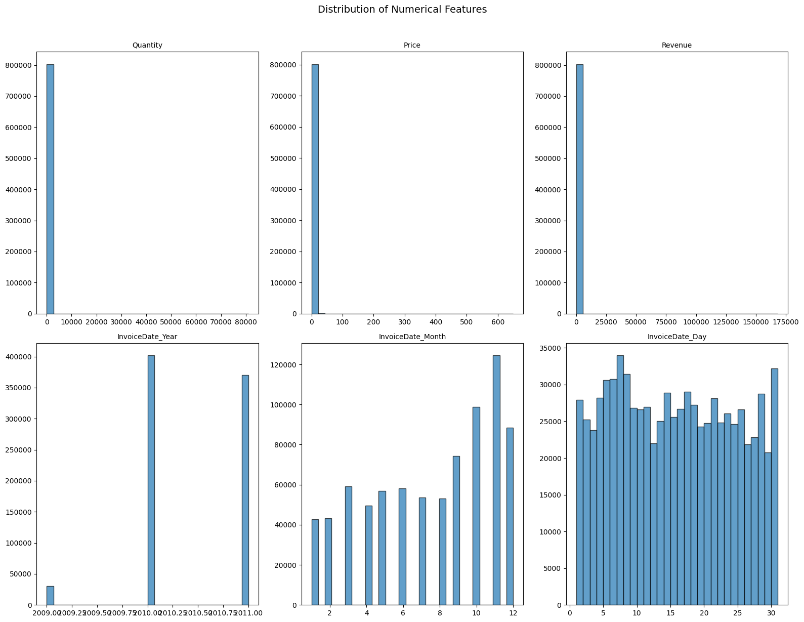
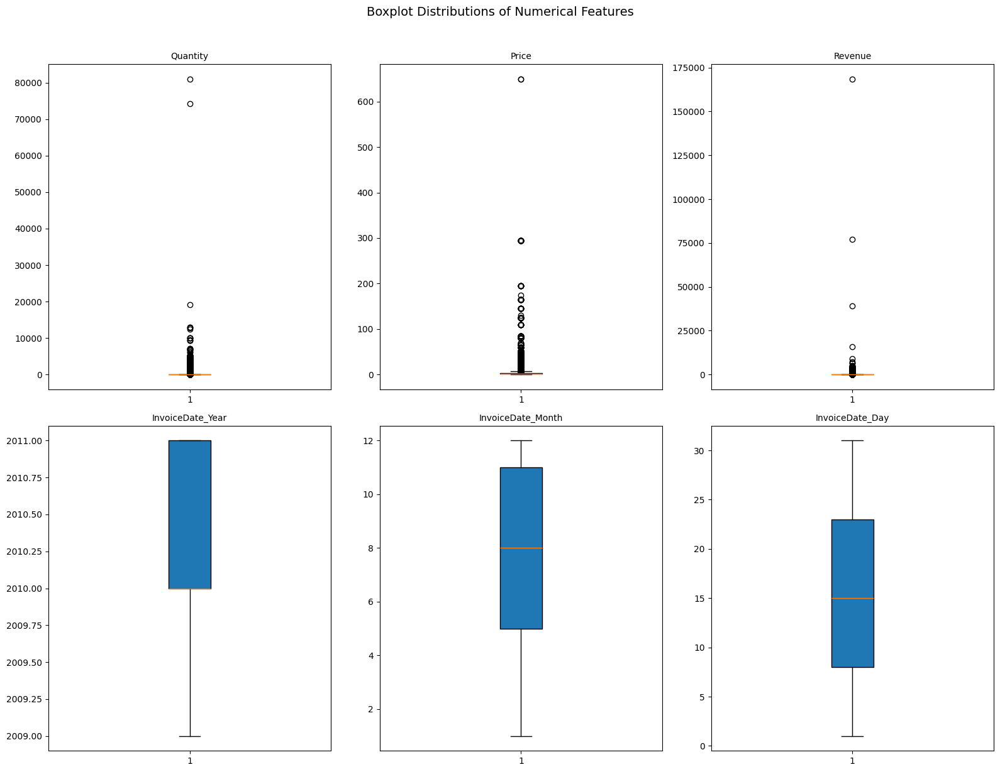
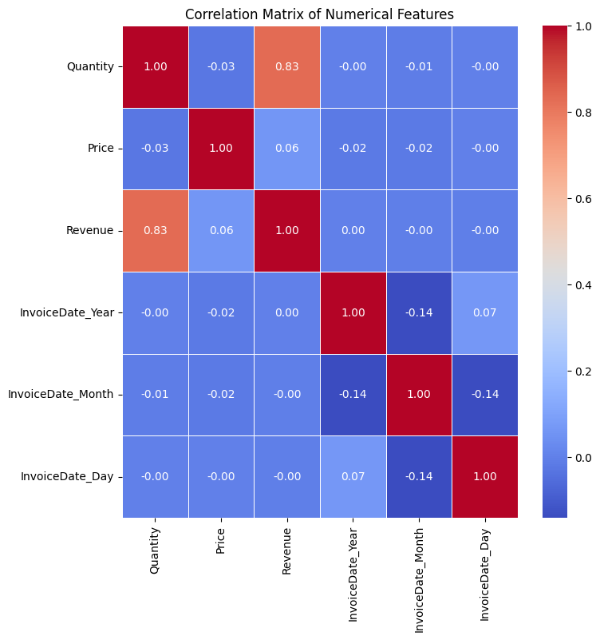
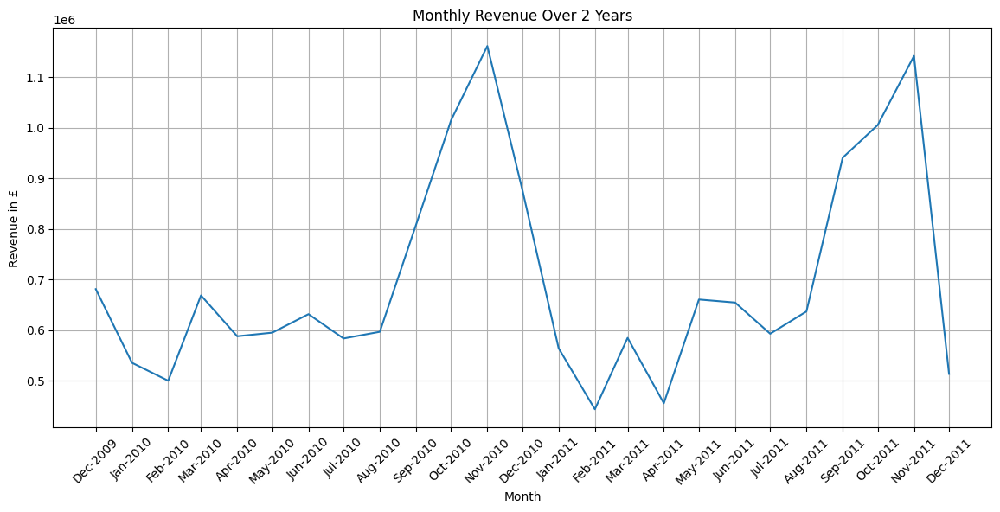

# 


## Dataset 
https://www.kaggle.com/datasets/mashlyn/online-retail-ii-uci

This dataset recods transactions from a online retail company registered and based in the United Kingdom between 1st of December 2009 and 9th of December 2011. They sell unique all-occasion gift-ware and have customers internationally.

I have decided to choose this dataset as it would allow myself to gain experience working in real-life retail datasets. 


## How to use this repo
1. Clone repo from the url: https://github.com/PearlisSad/Capstone-E-Commerce-Analysis.git

2. Create a virutal environment with

```console
 python3.10 -m venv venv
 ```

3. Activate environtment with:

(Windows)
```console
 venv\Scripts\activate
 ```
(Unix)
```console
 source venv/bin/activate
 ```

4. In the terminal, use the command below to install your dependencies. This may take several minutes.

 ```console
 pip install -r requirements.txt
 ```

5. Open the `jupyter_notebooks` directory, and click on the notebook you want to open.

6. Click the **kernel** button and choose **Python Environments**.

Note that the kernel says `Python 3.10.10` as it inherits from the venv, so it will be Python-3.10.10 if that is what is installed on your PC. To confirm this, you can use the command below in a notebook code cell.

```console
! python --version
```

## Python Version
- Python version 3.10.10

# Data cleaning
Dataset Features:
- Invoice
- StockCode
- Description
- Quantity
- InvoiceDate
- Price
- Customer ID
- Country

I have found missing values from Description and Customer ID. It is important that the descriptions and customer ids to be missing.

After further investigation, there are many rows where the transactions are returns or any other non-purchase transactions, so I have decided to drop them.

I have also changed the InvoiceDate into date_time and Customer ID to be int64.

I have also exported the clean dataset as ***sales.csv***

And I have also created a separate dataset that includes only transactions that are returns into ***returns.csv*** in case I needed to analyse it.

# Data Ethics
The dataset I have chosen does not include any personally identifiable information which allows the data to follow Confidentiality.

# Conclusions
From my end, I believe I could have spent my time on this project more efficiently and had proper planning and discipline.

I would have like to implement Machine Learning in order to 

# Exploratory Data Analysis






## Credits
- ***Code Institute LMS*** - Pandas and Data Visualisation
- ***Code Institute MasterClass files*** - Pandas, Data Visualisation and Machine Learning
- ***W3 Schools*** - Python refresher
- ***GeeksForGeeks*** - Pandas refresher
- ***DataCamp*** - Data Manipulation Courses
- ***StreamLit Documentation*** - Dashboard creation and presentation
- ***[EDA Overview](https://www.ibm.com/think/topics/exploratory-data-analysis)*** - Given me an insight into what I should look into and out for 
- ***GitHub Markdown Cheatsheet*** - To use for the README.md and Markdown cells in Jupyter Notebooks