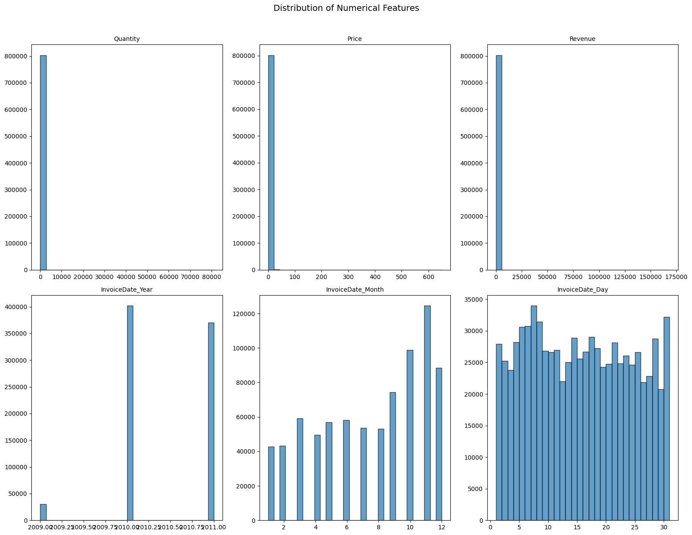
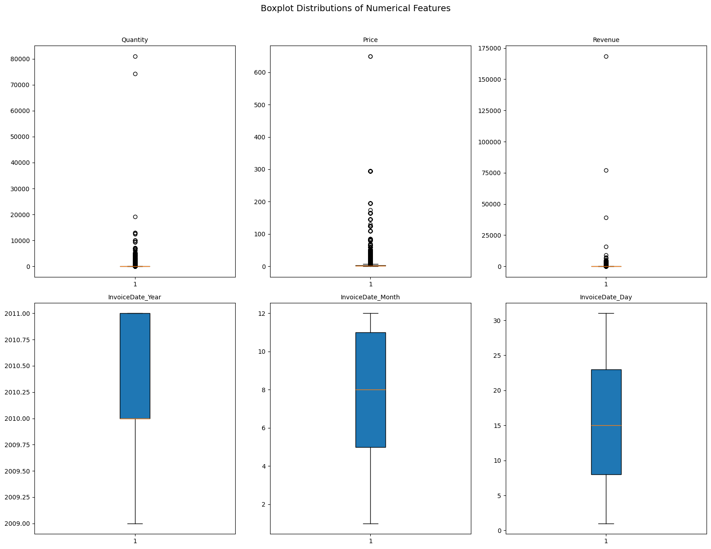
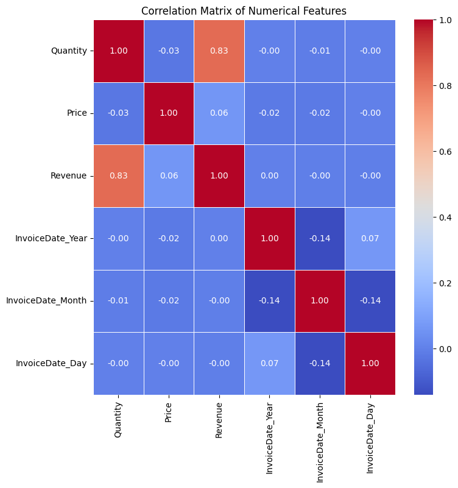
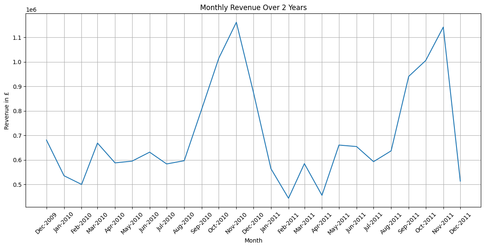

# 

# E‑Commerce Retail Analysis – Capstone Project

This project analyses two years of transactional data from a UK‑based online retail company. The goal is to explore customer purchasing behaviour, identify revenue trends, and provide insights that could support business decision‑making. The project includes data cleaning, exploratory data analysis (EDA), statistical exploration, and an interactive dashboard.

### Dataset
Source: Kaggle – Online Retail II (UCI)
https://www.kaggle.com/datasets/mashlyn/online-retail-ii-uci

The dataset contains all transactions from 1 December 2009 to 9 December 2011. The company sells unique all‑occasion giftware to customers worldwide.

Features:
- Invoice
- StockCode
- Description
- Quantity
- InvoiceDate
- Price
- CustomerID
- Country

I selected this dataset because it closely resembles real‑world retail data and provides opportunities to practice data cleaning, time‑series analysis, and customer behaviour analysis.

# Project Objectives
- Clean and prepare the dataset for analysis
- Explore purchasing patterns and revenue trends
- Apply descriptive and basic inferential statistics
- Build an interactive dashboard to communicate insights
- Document the methodology, reasoning, and data management practices
- Demonstrate the use of AI tools to support analysis


# Data Ethics & Privacy
- Dataset contains no personally identifiable information
- Follows confidentiality and ethical handling principles
- Ethical considerations documented in the notebook

# Quantitative Methods & Statistical Analysis
This project uses quantitative research methods to analyse numerical retail transaction data. The following statistical techniques were applied to understand patterns, trends, and relationships within the dataset:

## Descriptive Statistics
Descriptive statistics were used to understand the basic structure of the data before deeper analysis.

Used to summarise and understand the central tendencies and variability of key variables:

- Mean, median, and mode
- Standard deviation and variance
- Minimum, maximum, and range
- Distribution analysis (histograms, boxplots)

These measures helped identify typical purchasing behaviour, outliers, and the spread of transaction values.

## Correlation Analysis
Correlation analysis was selected to identify relationships that could influence revenue.

Correlation coefficients were calculated to examine relationships between numerical variables such as:

- Quantity
- Price
- Revenue

This allowed identification of:
- Strong positive correlation between Quantity and Revenue
- Weak negative correlation between Price and Revenue
- No correlation between Price and Quantity

## Time‑Series Analysis
Time‑series analysis was used because retail data naturally contains seasonal patterns.

Monthly revenue trends were analysed to identify:

- Seasonal patterns
- High‑demand periods
- Long‑term growth behaviour

This supports business decisions around stock planning and marketing.


## Why Quantitative Methods Were Used
The dataset consists entirely of numerical transactional data, making quantitative analysis the most appropriate approach. These methods allow:

- Objective measurement of customer behaviour
- Identification of statistically meaningful patterns
- Evidence‑based insights for business decision‑making

# Data Management Practices
To meet best practices:

### Data Collection
- Dataset sourced from Kaggle (publically available).
- Original file stored as online_retail_II.csv in the dataset/ directory.

### Data Quality Assessment
- Checked for missing values, duplicates, and inconsistent data types.
- Identified missing Description and CustomerID fields.
- Detected negative quantities representing returns.

### Data Cleaning
- Removed returns into returns.csv
- Cleaned dataset exported as sales.csv

I have found missing values from Description and Customer ID. It is important that the descriptions and customer ids to be missing.

After further investigation, there are many rows where the transactions are returns or any other non-purchase transactions, so I have decided to drop them.

I have also changed the InvoiceDate into date_time and Customer ID to be int64.

I have also exported the clean dataset as ***sales.csv***

And I have also created a separate dataset that includes only transactions that are returns into ***returns.csv***

These decisions were made to allow the dataset and analysis to reflect calculations that are actual sales activity without any of the readjustment and return records.

### Data Storage
online_retail_II.csv, returns.csv, and sales.csv files are in the dataset folder in the root directory.

### Data Processing
All transformations performed in Jupyter Notebooks

AI tools used for debugging and optimisation

## Reproducibility
All cleaning steps are documented in the Jupyter Notebook, ensuring the process can be repeated consistently.

# Exploratory Data Analysis


- Shows us the distribution of numerical features.


- Shows us the Boxplot distribution of numerical features. There is quite a large variety data within Quantity, Price and in turn Revenue.


- Shows the correlation of various numeric features
- High Positive Correlation between Revenue and Quantity: Shows us that transactions that order a higher quanitity of products often results in higher revenue gained.
- Weak Negative Correlation between Revenue and Price: Tells us that higher priced items could result in lower revenue per transaction.
- No Correlation between Price and Quantity: Tells us that the quantity of items purchased are not dictated by the price of the items.

- This shows us the general trend of revenue of the company over the 2 years.
- This shows that there is a gradual increase in revenue around september-October followed by a peak in November.
-This tells the company that marketing campaigns and restocking should occur within these months as they have the most revenue generated over the year.

## Dashboard and User Guide
A Streamlit dashboard was created to visualise:
- Revenue over Time
- Top products
- Country‑level sales
- Customer behaviour


## Independent Research: Advanced Streamlit Components
To enhance the functionality and user experience of the dashboard, I independently researched and implemented several Streamlit components that were not covered in the course material. These include:

### Sidebar Filters
I added interactive sidebar widgets such as:
- st.selectbox()
- st.multiselect()
- st.slider()

These allow users to filter the dataset by country, date range, or product category, making the dashboard more dynamic and user‑driven.

### Streamlit Caching (@st.cache_data)
I implemented caching to improve performance when loading and processing the dataset. This reduces load times and prevents unnecessary recomputation.

### Interactive Layout Components
I explored layout features such as:

- st.columns() for side‑by‑side charts
- st.tabs() for organising multiple views
- st.metric() for displaying KPIs

These components improve readability and help present insights more clearly.

Why This Demonstrates Independent Research
These enhancements go beyond the basic Streamlit features typically introduced in beginner‑level materials. Implementing them required:

- Reading and understanding the official Streamlit documentation
- Experimenting with different layout and interaction patterns
- Learning how caching and state management work in Streamlit

This reflects a willingness to explore new tools, deepen technical understanding, and extend the dashboard’s capabilities through self‑directed learning.

## The fully deployed dashboard can be viewed at the link below:
https://ci-capstone-raphael-magrina.streamlit.app

# Conclusions
This project provided valuable experience in working with real‑world retail transaction data, from initial cleaning through to exploratory analysis and dashboard development. The analysis revealed clear seasonal revenue patterns, strong relationships between quantity and revenue, and meaningful insights into customer purchasing behaviour.

While the project achieved its core objectives, there are several areas that could be expanded in future iterations:

- Machine Learning: Implementing techniques such as customer segmentation (K‑Means clustering) or demand forecasting would add predictive capability to the analysis.

- Feature Engineering: Creating product categories, customer cohorts, or basket‑level metrics would deepen the insights available.

- Enhanced Dashboard Functionality: Adding more interactive components, drill‑down views, or forecasting visualisations would improve usability.

- Improved Project Planning: A more structured planning process with clearer milestones would help manage time and scope more effectively.

Overall, this project strengthened my skills in data cleaning, quantitative analysis, visualisation, and dashboard development, while also highlighting opportunities for further growth in advanced analytics and project organisation. 


## How to use this repo
1. Clone repo from the url: https://github.com/PearlisSad/Capstone-E-Commerce-Analysis.git

2. Create a virutal environment with

```console
 python3.10 -m venv venv
 ```

3. Activate environtment with:

(Windows)
```console
 venv\Scripts\activate
 ```
(Unix)
```console
 source venv/bin/activate
 ```

4. In the terminal, use the command below to install your dependencies. This may take several minutes.

 ```console
 pip install -r requirements.txt
 ```

5. Open the `jupyter_notebooks` directory, and click on the notebook you want to open.

6. Click the **kernel** button and choose **Python Environments**.

Note that the kernel says `Python 3.10.10` as it inherits from the venv, so it will be Python-3.10.10 if that is what is installed on your PC. To confirm this, you can use the command below in a notebook code cell.

```console
! python --version
```

## Python Version
- Python version 3.10.10

## Credits
- ***Generative AI*** - Through various debugging and optimisation of code.
- ***Code Institute LMS*** - Pandas and Data Visualisation
- ***Code Institute MasterClass files*** - Pandas, Data Visualisation and Machine Learning
- ***W3 Schools*** - Python refresher
- ***GeeksForGeeks*** - Pandas refresher
- ***DataCamp*** - Data Manipulation Courses
- ***StreamLit Documentation*** - Dashboard creation and presentation
- ***[EDA Overview](https://www.ibm.com/think/topics/exploratory-data-analysis)*** - Given me an insight into what I should look into and out for 
- ***GitHub Markdown Cheatsheet*** - To use for the README.md and Markdown cells in Jupyter Notebooks